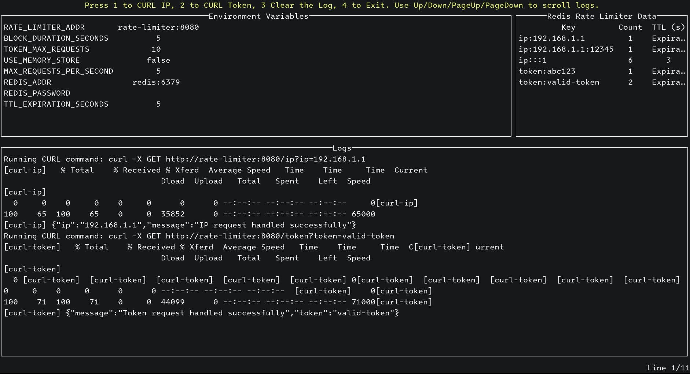

# Desafio Rate-Limiter

## Pré-requisitos

- Docker
- Go

---

## **Descrição Geral**

Este projeto implementa um **Rate Limiter** configurável em **Go**, capaz de limitar
requisições por **IP** ou por **Token de Acesso**, utilizando o Redis como mecanismo
de persistência. Ele é configurado via variáveis de ambiente ou arquivo `.env`.

---

## **Como Funciona**

### Middleware

- O rate limiter é injetado como middleware no servidor web.
- Bloqueia requisições excedentes baseando-se em limites configurados por IP ou token.

### Persistência

- As informações de controle do rate limiter são armazenadas no Redis, com suporte
para substituição por outras estratégias de armazenamento, seguindo o padrão Strategy.

### Configuração

- **Número máximo de requisições por segundo** e **tempo de bloqueio** são definidos
via variáveis de ambiente.
- O Redis é configurado para ser acessado de forma externa e segura.

### Respostas HTTP

- Quando o limite é excedido:
  - Código HTTP: `429`
  - Mensagem: `You have reached the maximum number of requests or actions allowed
    within a certain time frame`

### Endpoints Disponíveis

Após a execução, os seguintes endpoints estarão disponíveis:

- **`GET /`**: Página inicial de boas-vindas.
- **`GET /ip?ip=<IP>`**: Valida e aplica limites com base no endereço IP fornecido.
- **`GET /token?token=<TOKEN>`**: Valida e aplica limites com base no token de acesso
  fornecido.
- **`GET /health`**: Verifica a saúde do serviço.

---

## **Como Configurar**

Crie um arquivo `.env` na raiz do projeto e adicione as seguintes variáveis de ambiente:

```env
RATE_LIMITER_ADDR=rate-limiter:8080
REDIS_ADDR=redis:6379
REDIS_PASSWORD=
MAX_REQUESTS_PER_SECOND=5
TOKEN_MAX_REQUESTS=10
BLOCK_DURATION_SECONDS=5
TTL_EXPIRATION_SECONDS=5
USE_MEMORY_STORE=false
```

### Descrição das Variáveis

- **`RATE_LIMITER_ADDR`**: Define o endereço e a porta onde o servidor estará escutando.
- **`REDIS_ADDR`**: Endereço do Redis para armazenar e consultar os limites.
- **`REDIS_PASSWORD`**: Senha para autenticação do Redis, se necessário.
- **`MAX_REQUESTS_PER_SECOND`**: Número máximo de requisições por IP por segundo.
- **`TOKEN_MAX_REQUESTS`**: Limite de requisições por token, que se sobrepõe ao limite
  por IP.
- **`BLOCK_DURATION_SECONDS`**: Tempo de bloqueio em segundos após exceder o limite.
- **`TTL_EXPIRATION_SECONDS`**: Tempo de expiração dos contadores no Redis.
- **`USE_MEMORY_STORE`**: Define se o sistema usa Redis (`false`) ou armazenamento
  em memória (`true`).

---

## **Execução do Projeto com Docker Compose**

Execute o comando abaixo para iniciar todos os serviços:

```bash
docker-compose up --build
```

Isso irá subir os seguintes serviços:

- Redis
- Aplicação principal (Rate Limiter)
- Testes automatizados (unitários, integração e E2E)
- Redis TUI para visualização no terminal

---

## **Testes**

### Consultar Resultados

- **Testes Unitários**:

  ```bash
  docker logs unit-tests
  ```

- **Testes de Integração**:

  ```bash
  docker logs integration-tests
  ```

- **Testes End-to-End**:

  ```bash
  docker logs redis-e2e-tests
  ```

### Testes de Estresse

O teste foi realizado utilizando o Apache Benchmark:

```bash
for i in {1..50}; do
  ab -n 500 -c 25 "http://localhost:8080/ip?ip=192.168.1.$i" >> ip_stress_test.txt 2>&1 &
  ab -n 500 -c 25 -H "API_KEY: token$i" "http://localhost:8080/token" >> token_stress_test.txt 2>&1 &
done

wait
```

Os resultados estão armazenados na pasta `assets`.

---

## **Teste com TUI**

Após iniciar o Docker Compose, use o comando abaixo para abrir o TUI:

```bash
docker attach redis-tui
```

### Captura de Tela do Redis TUI

A interface a seguir apresenta os dados em tempo real:


